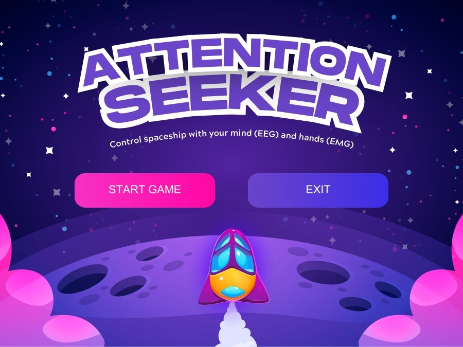
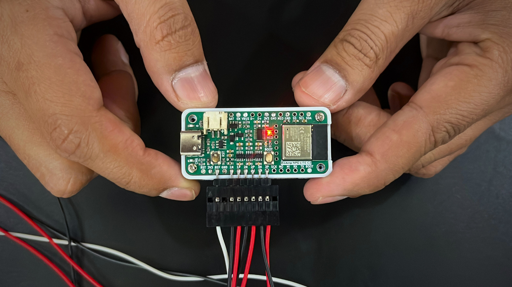

## Attention Seeker Game

*Attention Seeker* is an innovative neurofeedback game designed to help individuals enhance their focus in a fun and engaging way.

### Game Objective
Control a spaceship using your focus (EEG) and hand movements (EMG) to navigate through space and destroy obstacles.

### Hardware used
We have used *Neuro Play Ground (NPG) Lite* which is a  multichannel wireless bio-potential signal amplification device designed for recording *EMG, ECG, EOG, and EEG*. It comes in a compact Adafruit feather form factor and offers WiFi/BLE wireless connectivity. With the addition of daughter boards called Playmates, users can easily enhance the device’s capabilities, enabling the students/researchers/hobbyists to create awesome Human-Computer Interface (HCI) and Brain-Computer Interface (BCI) applications.

### Upload the Arduino Firmware

### Steps:
1. Connect *NPG Lite* to your laptop using a USB Type-A to Type-C cable.
2. Copy and paste the firmware link below in *Arduino IDE*:
   
   **[NPG_LITE_BLE](https://github.com/upsidedownlabs/Chords-Arduino-Firmware/blob/main/NPG-LITE-BLE/NPG_LITE_BLE.ino)**

3. Navigate to *Tools > Board > ESP32 C3*.
4. If using an *ESP32 board for the first time, install the **ESP32 by Espressif* library from the Board Manager.
5. Select the *COM port* where your board is connected and click *Upload*.

---

## Enable Bluetooth and Connect NPG Lite
Since data is transmitted via *BLE (Bluetooth Low Energy)*:
1. *Disconnect* the USB cable.
2. *Power on* the NPG Lite using the designated button.
3. *Enable Bluetooth* on your laptop.
4. *Connect* to NPG Lite to establish the connection.

---

## Download and Run the Game
### Steps:
1. *Download* the GitHub repository for the Attention Seeker Game.
2. *Extract* the folder.
3. *Open* the folder and launch the game by clicking on *landing.html*.

---

## How to Play
- *Game Begins*: The spaceship moves forward automatically.
- *Fire Lasers*: Increase focus (beta waves) above a threshold to fire at obstacles.
- *Move Left: Flex your **left hand* to shift the spaceship left.
- *Move Right: Flex your **right hand* to shift the spaceship right.
- *Destroy Obstacles*: Focus to fire and clear your path.

Enjoy playing *Attention Seeker* and improve your focus! 🚀